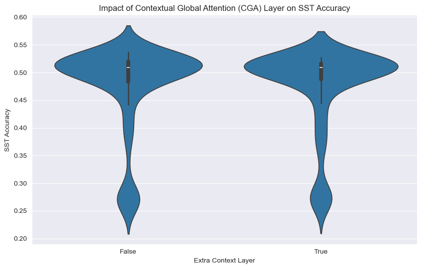
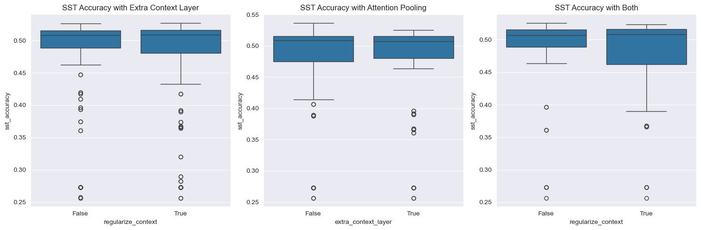

Here's a structured README template for your group project:

---

# G10 Neural Wordsmiths - DNLP SS24 Final Project

<div align="left">
<b>Group Name:</b> <b style="color:yellow;"> Neural Wordsmiths </b><br/><br/>
<b>Group Code:</b> G10<br/><br/>
<b>Group Repository:</b> <a href="https://github.com/Ugusu/dlfnlp-sose2024">Ugusu/dlfnlp-sose2024</a><br/><br/>
<b>Tutor Responsible:</b> Finn<br/><br/>
<b>Group Team Leader:</b> Ughur Mammadzada<br/><br/>
<b>Group Members:</b> Amirreza Aleyasin, Daniel Ariza, Pablo Jahnen, Enno Weber
</div>

---

## Introduction

[](https://www.python.org/downloads/release/python-3100/)
[](https://pytorch.org/)
[](https://www.apache.org/licenses/LICENSE-2.0)
[](https://img.shields.io/badge/Status-In%20Progress-yellow.svg)
[](https://www.python.org/dev/peps/pep-0008/)
[](./NeuralWordsmiths_AI_Usage_Card.pdf/)

This repository contains the official implementation of our final project for the Deep Learning for Natural Language Processing course at the University of Göttingen. The project involved implementing components of the BERT model and applying it to tasks like sentiment classification, paraphrase detection, and semantic similarity. Additionally, we implemented a BART model for paraphrase type generation and detection.

The project is divided into two main parts:

- **Part 01:** We implemented key aspects of the BERT model, including multi-head self-attention and Transformer layers, and applied it to tasks such as sentiment analysis, question similarity, and semantic similarity. Additionally, we implemented a BART model for paraphrase type generation and detection. Each task had at least one baseline implementation.
- **Part 02 (in progress):** We will fine-tune and extend the models to improve performance on the same downstream tasks. Several techniques from recent research papers will be explored to create more robust and semantically-rich sentence embeddings, aiming to improve over the baseline implementations.

The initial part focused on establishing a working baseline for each task, while the latter part will concentrate on refining and optimizing these models for better performance.

---

## Setup Instructions

To set up the environment and install dependencies for local development and testing, use the provided bash script `setup.sh`. This script creates a new conda environment called `dnlp` and installs all required packages. It will also check for CUDA and install the appropriate PyTorch version accordingly.

```sh
bash setup.sh
```

Activate the environment with:

```sh
conda activate dnlp
```

For setting up the repository on the remote GWDG cluster for training models with GPUs via SSH connection, use the `setup_gwdg.sh` script. This script is specifically designed to configure the environment for GPU-accelerated training on the GWDG cluster.

```sh
bash setup_gwdg.sh
```

---

## Training
### Local: 

To train the model, activate the environment and run:

```sh
python -u multitask_classifier.py --use_gpu
```

There are a lot of parameters that can be set. The most important ones are:

| Parameter               | Description                                                                           |
|-------------------------|---------------------------------------------------------------------------------------|
| `--task`                | Choose between `"sst"`, `"sts"`, `"qqp"`, `"multitask"` to train for different tasks. |
| `--seed`                | Random seed for reproducibility.                                                      |
| `--epochs`              | Number of epochs to train the model.                                                  |
| `--option`              | Determines if BERT parameters are frozen (`pretrain`) or updated (`finetune`).        |
| `--use_gpu`             | Whether to use the GPU for training.                                                  |
| `--subset_size`         | Number of examples to load from each dataset for testing.                             |
| `--context_layer`       | Include context layer if this flag is set.                                            |
| `--regularize_context`  | Use regularized context layer variant if this flag is set.                            |
| `--pooling`             | Choose the pooling strategy: `"cls"`, `"average"`, `"max"`, or `"attention"`.         |
| `--optimizer`           | Optimizer to use.                                                                     |
| `--batch_size`          | Batch size for training, recommended 64 for 12GB GPU.                                 |
| `--hidden_dropout_prob` | Dropout probability for hidden layers.                                                |
| `--lr`                  | Learning rate, defaults to `1e-3` for `pretrain`, `1e-5` for `finetune`.              |
| `--local_files_only`    | Force the use of local files only (do not download from remote repositories).         |
| `--smart_enable`        | Enables Smoothness-Inducing Adversarial Regularization (SMART).                       |
| `--epsilon`             | The epsilon (used in SMART).                                                          |
| `--alpha`               | Step size for adversarial perturbation in SMART.                                      |
| `--steps`               | Number of steps for generating perturbations in SMART.                                |

All parameters and their descriptions can be seen by running:

```sh
python multitask_classifier.py --help
```

### HPC:
to submit the job to a node in the GWDG HPC cluster, run:
settings can be configured according to the requirements in the `run_train.sh` file.
```sh
sbatch run_train.sh
```
---

## Evaluation

The model is evaluated after each epoch on the validation set. Results are printed to the console and saved in the `logdir` directory. The best model is saved in the `models` directory.

---

## Phase I

We implemented the base BERT and BART for the first phase of the project.

### BERT

For the BERT model we implemented 3 tasks:
- Sentiment Classification: The model got an additional classification layer, which takes as input the embedings from the BERT model. The used dataset is Stanford Sentiment Treebank. Loss function - Cross Entropy.
- Semantic Textual Similarity: Similar to the previous task, a classifier layer was added to the model. It takes as input the model's embedings, and predicts single logit, which defines the similarity score between senteces, which then is normilized to the range 0-5, 5 being most similar and 0 being related. Loss fucntion - Mean Squared Error Loss.
- Paraphrase Detection: The classifier layer at the end is similar to the previous task, with inputs being the embeddings of the model, and output a logit. The logit is normilized to the range 0-1, 1 being "is a paraphrase" and 0 being "not a paraphrase". Loss function - Binary Cross Entropy with Logits.

All embeddings go through a dropout layer, before being passed to the classifier layers.

For multitask training all tasks were run for 10 epochs with AdamW optimizer and hyperparameters:
- Learning rate: 1e-5
- Dropout probability: 0.2
- Batch size: 64
- Epsilon: 1e-8
- Betas: (0.9, 0.999)

For separate fine-tuning per tasks the hyperparameters were the same, except for Paraphrase Detection task, as 1 epoch is enough.

The model was trained on fine-tuning mode, so all parameters were updated.

BERT version: BERT Base Uncased.

### BART

BART has 2 tasks:

- BART_generation: for this task, we used the BART model to generate paraphrases of a given sentence.
  - We used the `BartForConditionalGeneration` model from the `transformers` library the pretrained `bart-large` has been used.
  - The model was trained on the `etpc-paraphrase-train.csv` dataset, which contains 2019 paraphrase pairs.
  - The model was fine-tuned on the `etpc-paraphrase-train.csv` dataset for 5 epochs with a batch size of 16.
  - The model was evaluated on the `etpc-paraphrase-dev.csv` and `etpc-paraphrase-generation-test-student` datasets.

- BART_detection: We used BART-large model to detect 7 differenct paraphrase types given a sentence. Tokenization was done using AutoTokenizer from the transformers library and using a pretrained BartModel from the same library, the model was fine-tuned on the etpc-paraphrase-train.csv using AdamW optimzer and CrossEntropyLoss loss function and validated on the etpc-paraphrase-dev.csv dataset for 5 epochs, learning rate 1e-5 and batch size 16. It is saved for best validation loss performance and was then tested on the etpc-paraphrase-generation-test-student dataset.

BART version: BART Large.

## Experiments

### Learning all tasks vs. Learning one task:

- A BERT model was trained to be able to solve all 3 tasks, and was compared to a BERT model trained on the tasks independetly.
- The results for Sentiment Classification and Semantic Textual Similarity degrade, while for Paraphrase Detection increase.
- Most probable explanation: Dataset sizes are not equal. Later or bigger trainings degrade previous or smaller trainings.
- Possible solution: Trainings on bigger datasets first. Number of epochs relative to dataset size.

---

# Phase II

## Improvements upon Base Models

## 1. Proposals

### 1.1 Contextual Global Attention (CGA)
As part of the improvements for the sentiment analysis task of the project, Contextual Global Attention 
(CGA) was introduced to enhance BERT's performance on the sentiment analysis task and in the pooling of the 
encoded output embeddings. This alternate mechanism aims to enhance BERT's ability to capture long-range 
dependencies by  integrating global context into its self-attention mechanism.

### 1.2 Pooling Strategies
While the **CLS** token is traditionally used as the aggregate representation in BERT's output, it may 
not fully capture the semantic content of an entire sequence. To address this, the following pooling 
strategies were tested:

* CLS token pooling
* Average pooling
* Max pooling
* Attention-based pooling

This experimentation aimed to identify whether these approaches could provide a more comprehensive 
representation, thereby improving the model's performance.

### 1.3 Dealing with Data Imbalance
The task at hand for the BART Paraphrase Type Detection was a multiclass classification problem. Every sentence pair has at least one of seven paraphrase types assigned to them. The dataset is very skewed towards type 2, 6 and 7 paraphrases, which proved to be quite challenging for part 1 of the project, where the model managed to achieve 83.3% accuracy, by overfitting on the dataset. An idea to fix this was implementing class weights into the Loss Function, which give each class a weight depending on their abundance. Less represented classes get higher importance, the trade-off however, would of course be a less accurate model. This approach was improved on by Li et al (2019) in 'Dice Loss for Data-imbalanced NLP Task, which dynamically adjust these weights, using the Dice-Score as a base for a loss function.

### 1.4 Smoothness-Inducing Adversarial Regularization (SMART)
Smoothness-Inducing Adversarial Regularization (SMART) is a regularization method, which makes the model learn smother boudaries.
The main principle behind the method is adding small noisy to the input of the model during finetuning, to make the model more generalized
around the data point *x*<sub>i</sub> and be immune the the small changes in the input.

## 2. Methodology

### BERT

### **2.1 Contextual Global Attention (CGA) Layer**

This layer computes a global context vector by averaging token embeddings and refining it through a feed-forward network. The refined context vector is incorporated into BERT’s self-attention mechanism via a custom **Contextual Global Attention (CGA)** mechanism, implemented in the `context_bert.py` file. 

The CGA mechanism introduces additional weight matrices and gating parameters that modulate the influence of the global context on token-level representations. A regularized variant of CGA, implemented as the `GlobalContextLayerRegularized` class, incorporates layer normalization and dropout to enhance model generalization and stability during training.

$$
\begin{bmatrix}
\hat{\mathbf{Q}} \\
\hat{\mathbf{K}}
\end{bmatrix} = (1 - \begin{bmatrix} \lambda_Q \\ \lambda_K \end{bmatrix}) \begin{bmatrix} \mathbf{Q} \\ \mathbf{K} \end{bmatrix} + \begin{bmatrix} \lambda_Q \\ \lambda_K \end{bmatrix} \mathbf{C} \begin{bmatrix} \mathbf{U}_Q \\ \mathbf{U}_K \end{bmatrix}
$$

It was decided to use the average of the hidden states across the entire input sequence as choice of context representation. This is called **"global context"**:

$$
\mathbf{c} = \frac{1}{n} \sum_{i=1}^{n} \mathbf{h}_i
$$

For further details on the workings of the CGA, refer to the original paper and the implementation in the code.

### **2.2 Pooling Strategies**

Different pooling strategies were explored to determine the most effective method for summarizing the information captured by BERT. These strategies included:

1. **CLS Token Pooling:**
The final hidden state of the CLS token, $\mathbf{h}_{\text{CLS}}$, is used as the aggregate representation:

$$
\mathbf{p} = \mathbf{h}_{\text{CLS}}
$$

2. **Average Pooling:**
The hidden states of all tokens are averaged to produce the sentence representation:

$$
\mathbf{p} = \frac{1}{n} \sum_{i=1}^{n} \mathbf{h}_i
$$

where $n$ is the number of tokens in the sequence.

3, **Max Pooling:**
The maximum value across all token hidden states is selected for each dimension:

$$
\mathbf{p}_j = \max_{i} \mathbf{h}_{ij}
$$

4. **Attention-Based Pooling:**
Attention scores from the Global Context Layer are used to compute a weighted sum of the hidden states:

$$
\mathbf{p} = \sum_{i=1}^{n} \alpha_i \mathbf{h}_i
$$

where $\(\alpha_i\)$ represents the attention weight assigned to each hidden state.

These pooling strategies were implemented and evaluated to identify the most effective approach for improving performance in sentiment analysis.

### **2.3 Smoothness-Inducing Adversarial Regularization (SMART)**

SMART receives the logits predictions of the model $$\gamma$$ and its input $$x$$. It then adds a noise (perturbation) $$\delta$$ to the input.
Before applying the noise to the input, it is updated for *M* steps depending on the gradient from the perturbed inputs.

$$\delta = \delta + \alpha \cdot \text{sign}(\nabla_{\delta} \mathcal{L}(\theta; x + \delta))$$

where $$\alpha$$ is the step size and $$\epsilon$$ is the maximum perturbation size.

Then the noisy input is used to make predictions:

$$\gamma_{\text{perturbed}} = \mathcal{F}(x + \delta)$$

The predictions on the noisy input are compared to the original predictions on the clear input, and a loss is computed. That loss is either KL-divergence
if the task is classification, or Mean Squared Error if the task is regression.

- Classification:

$$\mathcal{L}_{\text{SMART}} = \frac{1}{2} \left( \mathcal{KL}(\gamma_{\text{perturbed}} \parallel \gamma + \mathcal{KL}(\gamma \parallel \gamma_{\text{perturbed}}) \right)$$


- Regression:

$$\mathcal{L}_{\text{SMART}} = \frac{1}{N} \sum_{i=1}^{N} (\gamma_{\text{perturbed}, i} - \gamma_i)^2$$


Finally, the loss is then added to the task loss:

$$\mathcal{L}(\theta; x) = \mathcal{L}(\theta; x) + \mathcal{L}_\text{SMART}(\theta; x + \delta)$$

The training time is increased due to double back propagation.

---

## **3. Experiments**

### **3.1 Grid Search for Hyperparameter Optimization**

A comprehensive grid search was conducted to identify the optimal hyperparameters for the sentiment 
analysis task, particularly focusing on the integration of the newly introduced Contextual Global Attention. 
The search encompassed various combinations of pooling strategies, learning rates, dropout probabilities, 
batch sizes, epochs, and optimizers, resulting in 192 unique configurations. When combined with the four 
variations in the Contextual Global Attention (see bash scripts below), this amounts to a total of 
768 different configurations. It was executed in finetuning mode.

**Grid Search Configuration:**

- **Pooling Strategies:** `CLS Token`, `Average`, `Max`, `Attention`
- **Learning Rates:** `1e-5`, `5e-5`
- **Hidden Dropout Probabilities:** `0.3`, `0.5`
- **Batch Sizes:** `16`, `32`, `64`
- **Epochs:** `5`, `10`
- **Optimizers:** `AdamW`, `SophiaG`

**Execution Overview:**

The grid search was executed on the HPC cluster (as described in the setup section above), with the following key points:

- **Bash Scripts:** To initiate the grid search for different configurations of the CGA Layer, 
use the provided [bash scripts](sst_grid_search_experiments/experiment_scripts). These scripts correspond to various setups, including options with or 
without the extra layer and with or without regularization.

- **Result Storage:** Results for each grid search run were [saved](sst_grid_search_experiments/sst_experiments_grid_search_results) in JSON format, for analysis of the performance metrics for each configuration.

- **Manual Tuning:** Configuration options within the grid search [Python script](grid_search.py) can be manually adjusted to tweak the parameters being tested (lines 160-165).

- **Submission Script:** An executable script was also provided to manage the submission of all grid search jobs on the HPC cluster at once.

  ```sh
  submit_grid_search_jobs.sh
  ```

We recommend running these scripts from the project's home directory.

### **3.2 Experimenting with BART Paraphrase Type Detection**

Similar to above, the hyperparamter optimization was done using grid search in the BART Paraphrase Type Detection task on the GWDG HPC cluster. This can be done by running the [Python script](bart_detection_grid_search.py) file. With the additional parameter "weight_decay" in the optimizer, the MCC score can be improved, acting as L2 regularization, especially using the AdamW optimizer.
Additionally, early stopping with a patience of 3 was implemented to prevent overfitting and improve computation time over the 10 epochs.
Like Liu et al. (2023) recommends for Sophia optimizer, CosineAnnealing "with final LR equal to 0.05 times peak LR" is also used in addition to gradient clipping. Ininitally, I experimented with 
CosineAnnealing with warm up, but that seemed to make performance worse, as it would get stuck after the initial warm up for some reason, which may be due to bad initialization at that time.
As mentioned above, I wanted to expand on class weights with dice loss, but was unable to make it work in time.
---

## **4. Results**

### 4.1 BERT for Sentiment Prediction: Grid Search, CGA and Attention-based Pooling

#### **4.1.1 Data Overview**

A total of 768 experiments were conducted, all of which successfully completed. The experiments tested various configurations, including pooling strategies, learning rates, dropout probabilities, batch sizes, epochs, and optimizers.

#### **4.1.2 Overall Best SST Accuracy Performance**

The highest SST accuracy achieved was **0.537** with the following configuration:
- **Pooling Strategy:** `Attention`
- **Extra Context Layer:** `False`
- **Regularize Context:** `True`
- **Learning Rate:** `5e-5`
- **Hidden Dropout Probability:** `0.5`
- **Batch Size:** `64`
- **Optimizer:** `AdamW`
- **Epochs:** `5`

This configuration can be replicated by running the following script:

```sh
best_sst_performance.sh
```

However, due to random variation in training and evaluation, the exact accuracy value may not be equal, but within
the same order of magnitude.

#### **4.1.3 Overall Effect of CGA Layer on SST Performance**

The regularized Contextual Global Attention (CGA) Layer showed better accuracy than the non-regularized variant.
The following table shows the best accuracy values reached with and without the regularized CGA layer variant, and using
the optimal hyperparameters found via grid search. An improvement upon the baseline accuracy 0.522 of the vanilla version was
demonstrated:

| CGA Layer | Best SST Accuracy |
|-----------|-------------------|
| Baseline  | 0.522             |
| True      | 0.527             |
| False     | 0.537             |

The higher accuracy of the model without a CGA layer with respect to the baseline can be attributed to the newly introduced attention-based pooling using a CGA layer, as well as the alternate hyperparameter
selection optimized through the grid search.

The generated [violin plot](sst_grid_search_experiments/analyses_visualizations/impact_cga_sst_accuracy.png) shows that the model without the CGA Layer slightly outperformed the one with it, with most
results being concentrated on the ~0.500 mark for both types of models. 



#### **4.1.4 Effect of CGA Layers and Attention Pooling on SST Performance**

Additionally, the best SST performance under different conditions was as follows:

- The performance is quite stable across the configurations, with a median accuracy close to ~0.500.
- Outliers indicate that in some cases, the accuracy can drop significantly, especially when the context is not regularized.
- Regularizing context appears to have less impact on the distribution, but a few extreme low outliers are observed.



#### **4.1.4 Effectiveness of Pooling Strategies**


Pooling strategies were evaluated. CGA-based attention-pooling showed the best SST dev accuracy result.

| Pooling Strategy | SST Accuracy (Mean) | SST Accuracy (Max) |
|------------------|---------------------|--------------------|
| CLS (default)    | 0.472               | 0.534              |
| Attention        | 0.473               | 0.537              |
| Average          | 0.478               | 0.529              |
| Max              | 0.474               | 0.533              |

For an illustrative comparison, refer to the corresponding [box plot](sst_grid_search_experiments/analyses_visualizations/sst_accuracy_by_pooling_strategy.png).

#### **Metrics worth exploring further:**
- Model stability
- Training time

#### **Further Details:**
For a more in-depth analysis and additional results, refer to the accompanying Jupyter notebook, which we recommend to do
locally.

### 4.2 BART for Paraphrase Generation

#### **4.2.1 Data Overview**

The BART model was trained on the `etpc-paraphrase-train.csv` dataset, which contains 2019 paraphrase pairs. The model was fine-tuned for 3-10 epochs with a batch size of 1-100 and evaluated on the `etpc-paraphrase-dev.csv` and `etpc-paraphrase-generation-test-student` datasets.
The dev dataset has been generated from the `etpc-paraphrase-train.csv` dataset, by splitting it into 80% training and 20% validation data.

#### **4.2.2 Best Model Performance**

The best model performance was achieved with the following configuration:
- **Epochs:** `6`
- **Batch Size:** `64`
- **optimizer:** `SophiaG`
- **optimizer parameters:** `{'lr': 3e-05, 'betas': (0.1, 0.001), 'rho': 0.04, 'weight_decay': 0.1}`
- **scheduler gamma:** `0.675`
- **scheduler step size:** `1`
- **gradual unfreezing:** `8 layers`
- **rl_weight:** `0.85`
- **prefix length:** `10`
- **prefix method:** `"indirect"`

This configuration can be replicated by running the following script:
    
    
    python bart_generation.py --use_gpu
    

#### **4.2.3 PIP Prefix Method**

The Parse-Instructed Prefix (PIP) method was implemented to improve the quality of the generated paraphrases. The PIP method uses a parse tree to guide the generation of syntactically controlled paraphrases. The method was tested with different prefix lengths and methods to determine the optimal configuration for the BART model.
In simple words, the PIP method uses a prefix to guide the model in generating paraphrases that adhere to the syntactic structure of the input sentence.

Key features of the PrefixModel:

Prefix Addition: A learnable prefix is added to the input embeddings. This prefix acts as a task-specific prompt that guides the model's behavior.
```
self.prefix = nn.Parameter(torch.randn(1, prefix_length, base_model.config.d_model))
```

Indirect Method: The model uses an MLP to generate the actual prefix from the learnable parameters. This adds flexibility to the prefix generation.
```
self.prefix_mlp = nn.Sequential(
    nn.Linear(base_model.config.d_model, base_model.config.d_model),
    nn.ReLU(),
    nn.Linear(base_model.config.d_model, base_model.config.d_model)
)
```
Integration with Base Model: The prefix is concatenated with the input embeddings before being passed to the encoder.
```
inputs_embeds = torch.cat([prefix, inputs_embeds], dim=1)
```

Attention Mask Adjustment: The attention mask is adjusted to account for the added prefix.
```
prefix_attention_mask = torch.ones(batch_size, self.prefix_length, device=attention_mask.device)
attention_mask = torch.cat([prefix_attention_mask, attention_mask], dim=1)
```

### **4.2.4 Gradual Unfreezing**
Gradual unfreezing is a technique used to fine-tune large pre-trained models more effectively. It involves progressively unfreezing layers of the model during training, starting from the top (output) layers and moving towards the bottom (input) layers.
Key aspects of gradual unfreezing in this implementation:

Initial Freezing: A specified number of layers are initially frozen (parameters set to not require gradients).
```
for i in range(num_layers_to_freeze):
    for param in model.model.encoder.layers[i].parameters():
        param.requires_grad = False
```
Gradual Unfreezing: In each epoch or at specified intervals, a certain number of layers are unfrozen.
```
for i in range(num_layers_to_unfreeze):
    for param in model.model.encoder.layers[-i].parameters():
        param.requires_grad = True
```
Separate Unfreezing for Encoder and Decoder: The process is applied to both encoder and decoder layers independently.
Tracking Trainable Layers: The code keeps track of how many layers are trainable after each unfreezing step.
```
num_trainable = sum([1 for layer in model.model.encoder.layers for param in layer.parameters() if param.requires_grad])
```
Maximum Limit: A maximum number of layers to unfreeze is set to prevent unfreezing the entire model if not desired.
```
if num_trainable == max_layers:
    print(f"limit for unfreezing reached, {max_layers} layers are already unfrozen")
```


#### **4.2.5 Reinforcement Learning for Paraphrase Generation**

Reinforcement Learning (RL) was implemented to further enhance the quality of the generated paraphrases. The RL method uses a reward function to provide feedback to the model during training, encouraging it to generate more accurate and diverse paraphrases based on the reward.
The reward function for the paraphrase generation model is defined as:
$$
R = 0.5 \cdot B + 0.5 \cdot C
$$
where $(R)$ is the total reward, $(B)$ is the BLEU-like score, and $(C)$ is the cosine similarity score.

#### 1. BLEU-like Score (B)
The BLEU-like score is computed as:
$$
B = BP \cdot P
$$
where $(BP)$ is the brevity penalty and $(P)$ is the precision.

#### 2. Precision (P)
Let $(r)$ be the reference tokens and $(g)$ be the generated tokens. Then:
$$
P = \frac{\sum_{w \in g} \min(\text{count}_g(w), \text{count}_r(w))}{|g|}
$$
where $(\text{count}_g(w))$ and $(\text{count}_r(w))$ are the counts of word $(w)$ in the generated and reference sentences respectively.
Brevity Penalty $(BP)$
$$
BP = \begin{cases}
\exp(1 - \frac{|r|}{|g|}) & \text{if } |g| < |r| \
1 & \text{otherwise}
\end{cases}
$$
where $(|r|)$ and $(|g|)$ are the lengths of the reference and generated sentences respectively.
#### 3. Cosine Similarity Score (C)
The cosine similarity between the input sentence $(s_1)$ and the generated paraphrase $(s_2)$ is calculated as:
$$
C = \frac{\vec{v_1} \cdot \vec{v_2}}{||\vec{v_1}|| \cdot ||\vec{v_2}||}
$$
where $(\vec{v_1})$ and $(\vec{v_2})$ are the term frequency vectors of $(s_1)$ and $(s_2)$ respectively.
3. 
More explicitly:
$$
C = \frac{\sum_{w \in W} \text{tf}(w, s_1) \cdot \text{tf}(w, s_2)}{\sqrt{\sum_{w \in W} \text{tf}(w, s_1)^2} \cdot \sqrt{\sum_{w \in W} \text{tf}(w, s_2)^2}}
$$
where $(W)$ is the set of unique words in both sentences, and $(\text{tf}(w, s))$ is the term frequency of word $(w)$ in sentence $(s)$.

The training process uses a combination of supervised learning (SL) and reinforcement learning (RL) to optimize the paraphrase generation model. The loss function is a weighted sum of the SL loss and the RL loss.
$$
L_{total} = (1 - \alpha) L_{SL} + \alpha L_{RL}
$$
#### 4.2.6 Results #### 

The best model achieved a penalized BLEU score of 24.211 on the `etpc-paraphrase-dev.csv` dataset. The model was able to generate high-quality paraphrases that closely matched the original sentences. The PIP method and RL training significantly improved the quality of the generated paraphrases, demonstrating the effectiveness of these techniques in enhancing the performance of the BART model.

##### Note: ##### 
I observed the generations during training and noticed that outputs with neither low loss nor high penalized bleu score may not make sence to a human as a good paraphrase. Therefore the penalized_bleu score may not be the best optomization target for the model. So I used a combination of loss and penalized_bleu score as the reward for the RL training.

Examples:
- Input: `Through Thursday, Oracle said 34.75 million PeopleSoft shares had been tendered.`
- Target:  `Some 34.7 million shares have been tendered, Oracle said in a statement.`

- Generated: `Oracle Corp (ORCL.N) said on Thursday that 34.75 million PeopleSoft Corp shares had been tendered
  - Penalized BLEU: 30.4961
  - Loss: 1.1998

- Generated: `BRIEF-Moody's assigns a negative rating to Credit Suisse's portfolio of 32.75 million PeopleSoft shares that had been tendered. Through Thursday, PROPN VERB NUM NUM PROPN N`
  - Penalized BLEU: 33.1861
  - Loss: 4.2829

- Generated: `Oracle said 34.75 million PeopleSoft customers had been added to its database as of Thursday morning.`
  - Penalized BLEU: 33.4867
  - Loss: 0.7631

These results obtained using a subset of the data as the training set and validating on a subset of dev dataset.

### 4.3 BERT for Paraphrase Type Detection

#### **4.3.1 Effectiveness of Pooling Strategies**
 Average pooling was evaluated on two emmbedding strategies: a combined embedding for both sentences, independent embeddings for each sentence. The latter approach was tested with the default logit similarity prediction (concatenating both embeddings) and also with cosine similarity.
 
| Pooling Strategy                                     | STS Corr (Max)     |
|------------------------------------------------------|--------------------|
| CLS, combined, logit (default)                       | 0.864              |
| Average, combined, logit                             | 0.867              |
| Average, independent, logit                          | 0.406              |
| Average, independent, cosine similarity              | 0.406              |


Based on these results, I decided to add the average pooling strategie to the model from phase 1, keeping the combined embedding strategie and the logit similarity prediction.

### 4.4 BART for Paraphrase Type Detection

#### **4.4.1 Data Overview**

The BART model was also trained on the `etpc-paraphrase-train.csv` dataset, which contains 2019 paraphrase pairs. The model was fine-tuned  on `etpc-paraphrase-dev.csv` and `etpc-paraphrase-generation-test-student` datasets.
The dev dataset has been generated from the `etpc-paraphrase-train.csv` dataset, by splitting it into 80% training and 20% validation data.
#### **4.4.2 The MCC Score**
The MCC score is defined as:
$$
MCC = (TP x TN - FP x FN) \over (\sqrt(TP))
$$

#### **4.4.3 Impact of Class Weights on accuracy and MMC score**
| configuration                  |Accuracy             | MCC score          |
|--------------------------------|---------------------|--------------------|
| baseline                       | 83.33               | 0.067              |
| Class weights with baseline    | 61.5                | 0.148              |
| Best                           | 68.34               | 0.201              |

As predicted, the Accuracy will go down, as a compromise, due to prioritizing the minority class, but is still acceptable. The biggest problem with Class Weight implementation, was that it was very sensitive to bad hyperparamerization, especially when using SophiaG optimizer. The AdamW optimizer performed better on average and was more robust, but choosing a too low or high learning rate or too low batch size can make the model easily collapse.

#### **4.4.4 Overall best MCC score**
The highest MCC score achieved was **0.201** with the following configuration:
- **Pooling Strategy:** `Attention`
- **Extra Context Layer:** `False`
- **Regularize Context:** `True`
- **Learning Rate:** `5e-5`
- **Hidden Dropout Probability:** `0.5`
- **Batch Size:** `64`
- **Optimizer:** `AdamW`
- **Epochs:** `5`

### 4.5 Smoothness-Inducing Adversarial Regularization (SMART)

#### BERT: Paraphrase Detection:

Overall performance of the model seems to increase. The results are comparable to trainings done on higher number of epochs.
This also can be explained by the fact that SMART basically does data augmentation, and increases the training time on each epoch. Therefore the result is intuitive. Further scaling and computational performances are to be studied and compared.

#### BERT: Sentiment Classification:

SMART does not significatly affect the performance of this task. In most cases the accuracy is lower than the baseline. The obvious explanation is parameter overwrite during the second backpropagation.

#### BERT: Semantic Textual Similarity:

The performance of seems not improve much above the baseline. While the task is similar to Paraphrase Detection, the prediction is not binary and shows the degree of similarity. The alteration of the input by SMART scews the sequences and similar inputs seem to look less similar. In theory SMART still can be used for the task to improve performance, however the noise model should be handled in a more deliberate way.

### Best BERT: Paraphrase Detection:

The best performance (0.878) was achived with:

- **Epochs:** `2`
- **Batch Size:** `64`
- **optimizer:** `SophiaG`
- **optimizer parameters:** `{'lr': 1e-05, 'betas': (0.965, 0.99), 'rho': 0.04, 'weight_decay': 0.1}`
- **hidden_dropout_prob**: 0.2
- **smart_enabled** True
- **alpha** 0.02
- **steps** 1
- **epsilon** 1e-5
- **option** finetune

Can be replicated with:

```sh
$ python -u multitask_classifier.py --use_gpu --local_files_only --option finetune --task qqp --hidden_dropout_prob 0.2 --epochs 2 --smart_enabled
```

---

## Results Summary

### BART

The results for evaluation on the dev dataset. training was done for 6 epochs for paraphrase generation and 5 epochs for paraphrase detection.

|               | **Paraphrase Type Detection (MCC)** | **Paraphrase Type Generation ( Penalized_BLEU)** |
|---------------|-------------------------------------|--------------------------------------------------|
| Baseline      | 0.067                               | 20.790                                           |
| Improvement 1 | 0.148                               | 24.521 (without RL)                              |
| Improvement 2 | 0.201                               | 24.315 (with RL)                                 |

### BERT

For BERT model, fine-tuning was done 2 times. For Multitask the model learned all 3 tasks one after another. For Independet the model learned tasks separately.

The results for the dev dataset.

| **Multitask**                | **Sentiment Classification (acc)** | **Paraphrase Detection (acc)** | **Semantic Textual Similarity (cor)** |
|------------------------------|------------------------------------|--------------------------------|---------------------------------------|
| Baseline                     | 0.522                              | 0.877                          | 0.849                                 |
| Extra CGA Layer              | 0.263                              | 0.865                          | 0.770                                 |
| CGA-based Attention-Pooling  | 0.276                              | 0.867                          | 0.698                                 |
| Optimal Hyperparameters Only | 0.328                              | 0.874                          | 0.797                                 |
| Improvement 4                | ...                                | ...                            | ...                                   |
| Improvement 5                | ...                                | ...                            | ...                                   |
| Improvement 6                | ...                                | ...                            | ...                                   |


Here Paraphrase Detection was trained for 1 epoch:

| **Independent**                                | **Sentiment Classification (acc)** | **Paraphrase Detection (acc)** | **Semantic Textual Similarity (cor)** |
|------------------------------------------------|------------------------------------|--------------------------------|---------------------------------------|
| Baseline                                       | 0.534                              | 0.860                          | 0.863                                 |
| Extra CGA Layer                                | 0.520                              | 0.876                          | 0.851                                 |
| CGA-based Attention-Pooling                    | 0.530                              | 0.854                          | 0.850                                 |
| Using Grid Search Optimal Hyperparams (no CGA) | 0.530                              | 0.873                          | 0.861                                 |
| SMART                                          | 0.515                              | 0.867                          | 0.856                                 |
| Improvement 5                                  | ...                                | ...                            | ...                                   |
| Improvement 6                                  | ...                                | ...                            | ...                                   |


---

## Members Contribution

Explain the contribution of each group member:

**Daniel Ariza:**
- Phase 1:
  - Implemented the `embed` function in the `BertModel` class.
  - Implemented missing functionality for the sentiment analysis task.
  - Assisted in adding docstrings and type hints to functions in `bert.py` and `multitask_classifier.py`.
- Phase 2:
  - Improved sentiment analysis task accuracy by implementing and experimenting with:
    - Contextual Global Attention (CGA)
    - Pooling strategies, including CGA-based attention-pooling
    - Grid search experimentation for optimal hyperparameters

**Amirreza Aleyasin:**
- Phase 1:
  - Implemented the BART model for `paraphrase generation` and detection.
  - Implemented the `AdamW optimizer`.
- Phase 2: 
  - Implemented the `SophiaG optimizer` based on original repo. link: https://github.com/Liuhong99/Sophia
  - Implemented the Parse-Instructed Prefix for Syntactically Controlled Paraphrase Generation [Wan et al., 2023] (PIP) paper.
  - Hyperparameter search and tracking with about 100 experiments.
  - Trying methods from LLama 3 like rotary positional encoding and SwiGLU activation function.
  - Using gradual unfreezing and discriminative learning rates for training.
  - trying genetic algorithm for multi-objective optimization of hyperparameters optimizing for both best penalized_BLEU and loss.
  - Implemented Reinforcement Learning for paraphrase generation. araphrase Generation with Deep Reinforcement Learning [Li, Jiang, Shang et al., 2018]
- 
**Pablo Jahnen:**
- Phase 1:
  - Implemented the `attention` function in the `BertSelfAttention` class.
  - Developed functionality for similarity prediction task.
  - Developed the training loop for similarity prediction task.
- Phase 2: 

**Ughur Mammadzada:**
- Phase 1:
  - Implemented the `BertLayer` class.
  - Developed functionality for paraphrase prediction task.
  - Developed the training loop for paraphrase prediction task.
- Phase 2: ...

**Enno Weber:**
- Phase 1: 
  - Implemented BART paraphrase detection transformer, training loop and test function.
- Phase 2:
  - Implemented Class Weights into CV Loss Function
  - Extensive Hyperparameter Search
  - Implemented Early Stopping
  - Compared and implemented different Learning Rate schedulers including CosineAnnealingLR and CosineAnnealingLR with warmup
  - improved regularization by adding weight decay to optimizer

---

## AI-Usage Card

Artificial Intelligence (AI) aided the development of this project. For transparency, we provide our [AI-Usage Card](./NeuralWordsmiths_AI_Usage_Card.pdf/) at the top.

## References

- [Project Description Deep Learning for Natural Language Processing University of Göttingen Teaching Staff](https://docs.google.com/document/d/1pZiPDbcUVhU9ODeMUI_lXZKQWSsxr7GO/edit): Lecturer: Dr. Terry Ruas, Teaching Assistants: Finn Schmidt, Niklas Bauer, Ivan Pluzhnikov, Jan Philip Wahle, Jonas Lührs
- [BERT: Pre-training of Deep Bidirectional Transformers for Language Understanding](https://arxiv.org/abs/1810.04805): Jacob Devlin, Ming-Wei Chang, Kenton Lee, Kristina Toutanova
- [Attention Is All You Need](https://arxiv.org/abs/1706.03762): Ashish Vaswani, Noam Shazeer, Niki Parmar, Jakob Uszkoreit, Llion Jones, Aidan N. Gomez, Lukasz Kaiser, Illia Polosukhin
- [Paraphrase Types for Generation and Detection](https://aclanthology.org/2023.emnlp-main.746.pdf): Jan Philip Wahle, Bela Gipp, Terry Ruas, University of Göttingen, Germany {wahle,gipp,ruas}@uni-goettingen.de
- [SemEval-2016 Task 1: Semantic Textual Similarity, Monolingual and Cross-Lingual Evaluation](https://www.researchgate.net/publication/305334510_SemEval-2016_Task_1_Semantic_Textual_Similarity_Monolingual_and_Cross-Lingual_Evaluation): Eneko Agirre, Carmen Banea, Daniel Cer, Mona Diab
- [SophiaG Optimizer](https://arxiv.org/abs/2305.14342): Liu et al., 2023
- [Parse-Instructed Prefix for Syntactically Controlled Paraphrase Generation](https://aclanthology.org/2023.findings-acl.659/): Wan et al., 2023
- [Rotary Positional Encoding](https://arxiv.org/abs/2104.09864v5): Su et al., 2021
- [SwiGLU Activation Function]()https://arxiv.org/abs/2002.05202v1: Noam Shazeer, 2020
- [Paraphrase Generation with Deep Reinforcement Learning](https://aclanthology.org/D18-1421/): Li, Jiang, Shang et al., 2018
- [Gradual Unfreezing and Discriminative Learning Rates](https://arxiv.org/pdf/1801.06146): Howard and Ruder, 2018
- [Context-aware Self-Attention Networks](https://arxiv.org/abs/1902.05766): Baosong Yang, Jian Li, Derek Wong, Lidia S. Chao, Xing Wang, Zhaopeng Tu
- [Self-Attentive Pooling for Efficient Deep Learning](https://arxiv.org/abs/2209.07659): Fang Chen, Gourav Datta, Souvik Kundu, Peter Beerel
- [Dice Loss for Data-imbalanced NLP Task](https://arxiv.org/abs/1911.02855): Li et al., 2019

## Acknowledgement

The project description, partial implementation, and scripts were adapted from the final project for the Stanford [CS 224N class](https://web.stanford.edu/class/cs224n/). The BERT implementation was adapted from the "minbert" assignment at Carnegie Mellon University's [CS11-711 Advanced NLP](http://phontron.com/class/anlp2021/index.html). Parts of the code are from the [`transformers`](https://github.com/huggingface/transformers) library. Scripts and code were modified by [Jan Philip Wahle](https://jpwahle.com/) and [Terry Ruas](https://terryruas.com/).


